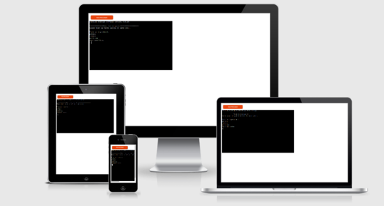

# ------------------Feed the computer!-------------------------

The computer is hungry! Find what it wants to eat before it eats you!

Feed the computer! is a Python terminal game, which runs of the Code Institute mock terminal on Heroku.

In this game, the user is challenged to guess what does the computer wants, by choosing, one after an other, the 3 different ingredients that will be served to the machine.

<a href="https://feed-the-computer.herokuapp.com/">Here is the live version of my project.</a>

## How to play

Feed the computer! Is a simple quiz game with mostly luck required.

At the beginning of the game, the user will be asked to pick a first ingredient.

If the user's guess is right, the next list of ingredient choices will be shown,

and so until the third and last choice which will bring the user to a victory or a loss.

A pool of 4 lives will be provided to the user, losing one every wrong ingredient chosen.

## Features

### Existing features

-Generate computer's choice a the beginning of the game.

-Takes user input and verify if the answer is found in the list of ingredients, otherwise 

return a message that indicate the error.

-Keep count of the number of attempt used and end the game if the maximum is reached.

### Future features

-Different levels of difficulty

-More choices of ingredients

-Other types of questions

-Different ending of the game

## Flow

