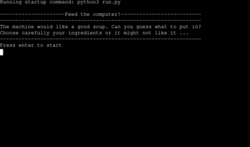
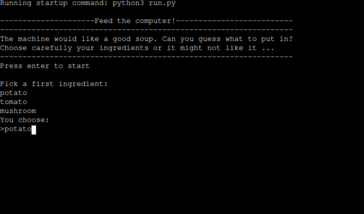
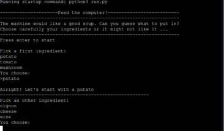
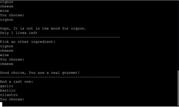
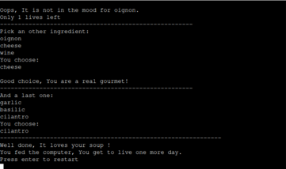

# ------------------Feed the computer!-------------------------

The computer is hungry! Find what it wants to eat before it eats you!

Feed the computer! is a Python terminal game, which runs of the Code Institute mock terminal on Heroku.

In this game, the user is challenged to guess what does the computer wants to eat, by choosing, one after an other, the 3 different ingredients that will be served to the machine.

<a href="https://feed-the-computer.herokuapp.com/">Here is the live version of my project.</a>

## How to play

Feed the computer! Is a simple quiz game with mostly luck required.

At the beginning of the game, the user will be asked to pick a first ingredient.

If the user's guess is right, the next list of ingredient choices will be shown,

and so until the third and last choice which will bring the user to a victory or a loss.

A pool of 4 lives will be provided to the user, losing one every wrong ingredient chosen.

## Features

### Existing features

-Generate computer's choice a the beginning of the game.

-Takes user input and verify if the answer is found in the list of ingredients, otherwise 

return a message that indicate the error.

-Keep count of the number of attempt used and end the game if the maximum is reached.

### Future features

-Different levels of difficulty

-More choices of ingredients

-Other types of questions

-Different ending of the game

## Flow

-At the beginning of the game, the user is asked to press the enter key to start the game.
This is helps to control the flow of the application

-Print the first list of ingredients and takes user's input.

-If input is correct, let the user know and print the new list of ingredients

-If input is does not match the computer's choice, remove one life and let the user try again.

-The game ends when the last ingredient is found.

## Data model

For this program, I have decided to use a panel of functions within a main game function.

- For each round
    - we print the options
    - we get the user's input
        - if the input is in the options:
            - if it matches the computer choice:
                - we return the next round   
            - else
                - we reduce the live
                
                - we reload the same round
        - else
            - we show error message
            - we reload the same round
    - if third round is won:
        -return the won game function
    - if live is < 1:
        - we end the game with a lose

A future improvement will be to write this code in an more Object oriented approach, 

using a Class for the main structure of the game.

## Testing

I have manually tested this program by doing the following:

-Pass the code through a pep8 linter and confirmed that there is no issues.

-Tested in the gitpod terminal and the Code Institute Heroku terminal.

## Remaining Bugs

-When lives reached 0, a last turn is given to the user while the computer as made a new 

choice. The game is then lost.

## Deployment

This project was deployed using Code Institute mock terminal on Heroku.

-Steps for deployment:

-Fork or clone this repository

-Create a new Heroku app

-Set the buildbags to python and NodeJS in that order

-Link the Heroku app to the repository

-Click on deploy

